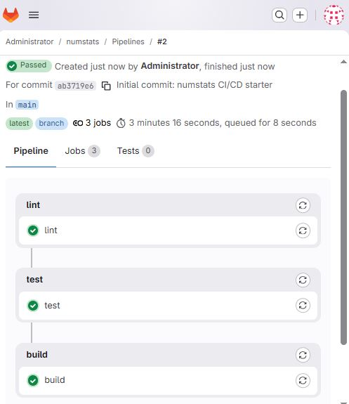

# gitlab-ci-python-starter

A minimal but complete **CI/CD pipeline running on a self-hosted GitLab CE**
instance. A tiny Python CLI (`numstats`) is the payload; the point of the
project is everything *around* it: standing up GitLab and a runner in Docker,
and a three-stage pipeline that lints, tests, and builds the package.

> This is a deliberately small starter. It is the foundation for a larger
> project (an aerospace telemetry CI/CD platform) — see
> [Where this goes next](#where-this-goes-next).

## What it demonstrates

- **Self-hosted GitLab CE + GitLab Runner** in Docker (`local-gitlab/docker-compose.yml`)
- A **multi-stage GitLab pipeline** (`.gitlab-ci.yml`): `lint -> test -> build`
- Containerised, reproducible jobs (each stage runs in a fresh `python:3.12-slim`)
- **JUnit + coverage reporting** surfaced in the GitLab UI, and a **wheel artifact**
- A clean, testable `src/` Python package with `ruff` + `pytest`

## Pipeline

| Stage | What it does | Tooling |
|-------|--------------|---------|
| `lint`  | Static checks on the code | `ruff check` |
| `test`  | Unit tests + coverage, JUnit report | `pytest`, `pytest-cov` |
| `build` | Build a distributable wheel (artifact) | `python -m build` |



## Quickstart (just the app)

```bash
python -m venv .venv && source .venv/bin/activate
pip install -e ".[dev]"
pytest                 # run the tests
numstats 2 4 4 4 5 5 7 9
echo "1,2,3,4,5" | numstats
```

## Run the full self-hosted pipeline

The pipeline runs on your own local GitLab. The full, step-by-step walkthrough
(standing up GitLab, registering the runner, pushing, and publishing to GitHub)
is in **[docs/SETUP.md](docs/SETUP.md)**.

## How the GitHub repo relates to the GitLab pipeline

This public repo on GitHub is the **showcase**. The pipeline itself runs on a
**self-hosted GitLab CE** instance on your machine — that is the whole point of
the project. In practice the same code lives in two places via two git remotes:

- `origin`  -> GitHub (public portfolio)
- `gitlab`  -> your local GitLab CE (runs the real `.gitlab-ci.yml` pipeline)

An optional GitHub Actions workflow (`.github/workflows/ci.yml`) mirrors the
lint+test steps so the GitHub page also shows passing checks. See SETUP.md.

## Where this goes next

This is step one of a path toward a larger portfolio project. Natural upgrades,
roughly in order:

1. Add a `fetch` stage that downloads real external data in the pipeline.
2. Swap the `numstats` logic for domain logic (e.g. validating + processing
   satellite TLE orbital data from CelesTrak).
3. Add a `docker build` + push to GitLab's built-in container registry.
4. Add observability: push pipeline metrics to a Prometheus Pushgateway and
   chart them in Grafana.
5. Provision the host with Terraform instead of running locally.

## License

MIT — see [LICENSE](LICENSE).
